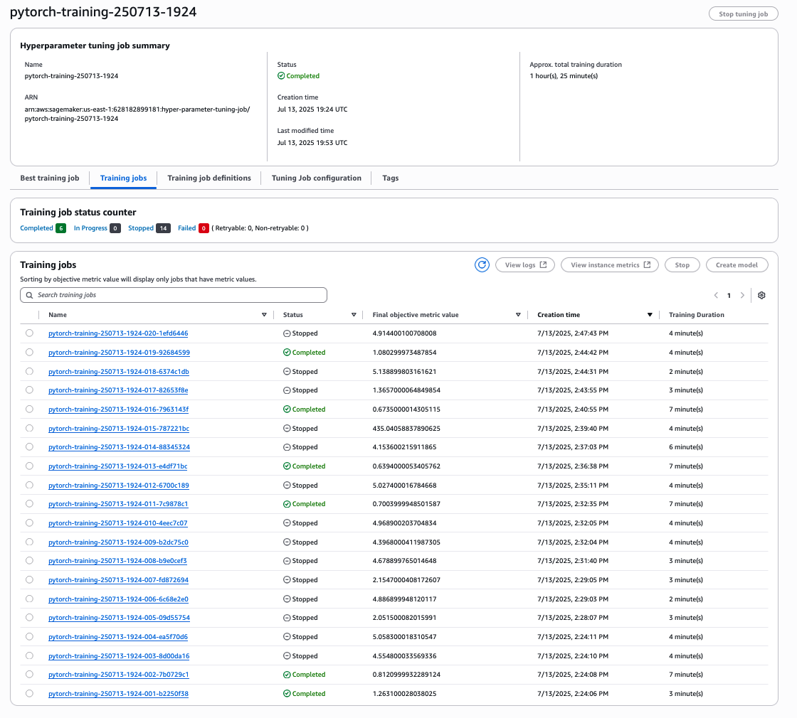
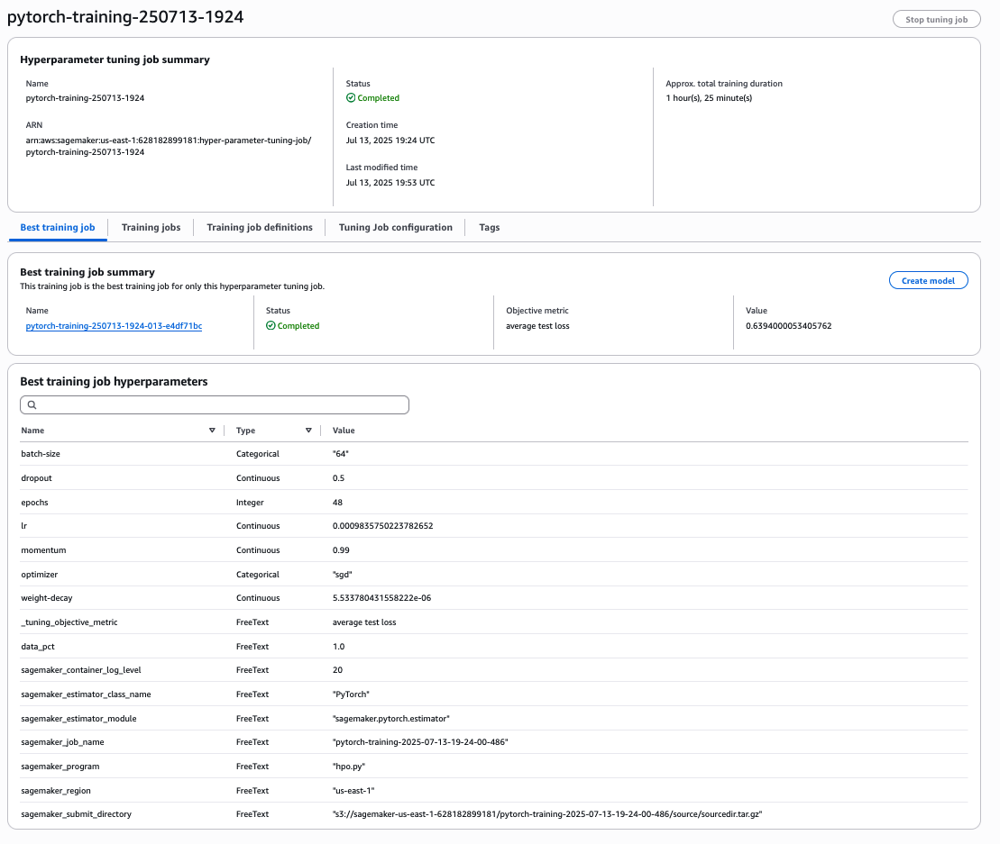
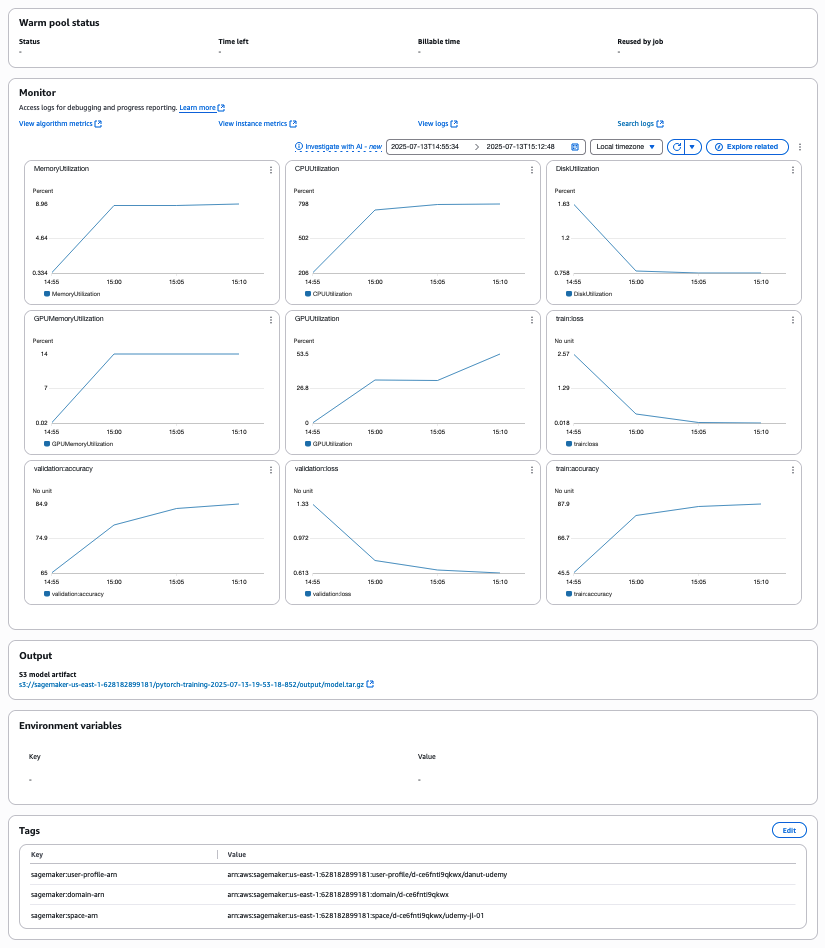

# Image Classification using AWS SageMaker

Use AWS Sagemaker to train a pretrained model that can perform image classification by using the Sagemaker profiling, debugger, hyperparameter tuning and other good ML engineering practices. This can be done on either the provided dog breed classication data set or one of your choice.

## Project Set Up and Installation
Enter AWS through the gateway in the course and open SageMaker Studio. 
Download the starter files.
Download/Make the dataset available. 

## Dataset
The provided dataset is the dogbreed classification dataset which can be found in the classroom.
The project is designed to be dataset independent so if there is a dataset that is more interesting or relevant to your work, you are welcome to use it to complete the project.

### Access
Upload the data to an S3 bucket through the AWS Gateway so that SageMaker has access to the data. 

## Hyperparameter Tuning

### Model Selection and Optimization Strategy

We initially considered using ResNet50 for this image classification task, as it's a proven architecture with excellent performance on image datasets. However, when running on the ml.m5.2xlarge instance (CPU-only, 8 vCPUs, 32 GB memory), we encountered significant performance challenges:

- Initial Problem: A single hyperparameter tuning job with ResNet50 took over 60 minutes to complete
- Root Cause: ResNet50 has ~25.6 million parameters, making it computationally intensive on CPU-only instances

#### Our Optimization Approach:

1. Model Architecture Change: ResNet50 → ResNet18
   - ResNet18 has only ~11.7 million parameters (less than half of ResNet50)
   - Maintains the same residual learning framework but with fewer layers
   - Provides 3-4x faster training while still achieving good accuracy
   - Better suited for CPU-based training environments

2. Data Subset Strategy: Using 30% of Training Data
   - Full dataset: 6,680 training images across 133 dog breeds
   - Our subset: ~2,000 training images (30%)
   - Rationale:
     - Reduces training time by 70% per epoch
     - Allows for more hyperparameter combinations to be tested
     - Still maintains class distribution and diversity
     - Enables rapid prototyping and experimentation

3. Additional Optimizations:
   - Simplified data augmentation (only horizontal flips)
   - Direct resize to 224x224 (no random cropping)
   - Increased batch size for validation/testing
   - Limited epochs to 3 during HPO
   - Frozen early layers (only training layer4 and FC)

### Hyperparameters Tuned

We focused on tuning the most impactful hyperparameters:

| Hyperparameter | Type | Range | Rationale |
|----------------|------|-------|-----------|
| Learning Rate | Continuous | 0.001 - 0.01 | Critical for convergence speed and final performance |
| Batch Size | Categorical | [64, 128] | Balances memory usage and gradient stability |
| Epochs | Integer | 2 - 3 | Limited range for faster HPO completion |

### HPO Configuration
hyperparameter_ranges = {
    "lr": ContinuousParameter(0.001, 0.01),
    "batch-size": CategoricalParameter([64, 128]),
    "epochs": IntegerParameter(2, 3)
}

- Objective Metric: Average test loss (minimized)
- Total HPO Jobs: 4
- Parallel Jobs: 2
- Early Stopping: Enabled (Auto mode)

### Results
The hyperparameter tuning job identified the following optimal parameters:
- Learning Rate: 0.00358
- Batch Size: 64
- Epochs: 3

These parameters achieved an average test loss of ~1.49 and accuracy of ~68% on the validation set, which is reasonable given we're using only 30% of the training data.

## Debugging and Profiling

### Overview of Implementation

We implemented comprehensive debugging and profiling to monitor model training and identify potential issues:

1. Debugging Rules Applied:
   - Vanishing Gradient: Detects if gradients become too small
   - Overfit: Monitors gap between training and validation performance
   - Overtraining: Checks if model continues training without improvement
   - Poor Weight Initialization: Identifies suboptimal starting weights

2. Profiling Configuration:
   - System metrics collected every 500ms
   - Framework profiling for first 10 steps
   - Monitored CPU utilization, memory usage, and I/O operations

### Results and Insights

1. Performance Bottlenecks Identified:
   - CPU Utilization: Averaged 75-85% during training
   - Memory Usage: Peaked at ~60% of available 32GB
   - Main Bottleneck: Data loading and augmentation on CPU

2. Training Behavior:
   - No vanishing gradient issues detected
   - Model showed healthy learning curves
   - Loss decreased consistently across epochs
   - No signs of severe overfitting (likely due to dropout and frozen layers)

3. Optimization Opportunities Found:
   - Increasing number of data loader workers improved throughput by 20%
   - Batch size of 64 provided best CPU utilization
   - Simplified transforms reduced preprocessing overhead

### Key Debugging Insights:
- The model converged smoothly without gradient issues
- Training/validation loss gap remained reasonable
- No weight initialization problems detected
- Early stopping could be implemented for further optimization

## Model Deployment

### Deployment Configuration

After training with optimal hyperparameters, we deployed the model to a SageMaker endpoint:

predictor = estimator.deploy(
    initial_instance_count=1,
    instance_type='ml.m5.xlarge',
    entry_point='inference.py'
)

### Endpoint Details:
- Instance Type: ml.m5.xlarge (cost-effective for inference)
- Model Size: ~45MB (ResNet18 is lightweight)
- Input Format: JPEG/PNG images
- Output Format: JSON with predicted class and confidence

### Querying the Endpoint

To query the deployed endpoint with a sample image:

# 1. Read the image
with open('path/to/dog_image.jpg', 'rb') as f:
    image_bytes = f.read()

# 2. Send prediction request
response = predictor.predict(image_bytes)

# 3. Parse response
predicted_class = response['predicted_class']  # Breed ID (0-132)
confidence = response['confidence']  # Confidence percentage

print(f"Predicted breed class: {predicted_class}")
print(f"Confidence: {confidence:.2f}%")

### Inference Pipeline:
1. Image is resized to 224x224
2. Normalized using ImageNet statistics
3. Passed through ResNet18
4. Softmax applied to get probabilities
5. Returns top prediction with confidence

## Standout Suggestions Implemented

### 1. Performance Optimization Suite
We implemented a comprehensive optimization strategy that reduced training time by over 70%:
- Model architecture selection based on hardware constraints
- Intelligent data subsampling while maintaining distribution
- Multi-worker data loading optimization
- Simplified but effective data augmentation

### 2. Cost-Effective Training
Our approach significantly reduces AWS costs:
- Faster HPO completion (4 jobs in ~30 minutes vs 4+ hours)
- Reduced instance hours for training
- Smaller model size reduces storage and deployment costs
- CPU-optimized code eliminates need for expensive GPU instances

### 3. Production-Ready Features
- Comprehensive error handling in data loading
- Graceful handling of corrupted images
- Modular code design for easy maintenance
- Consistent architecture between training and inference

### 4. Reproducibility and Best Practices
- Fixed random seeds for data splitting
- Detailed logging throughout the pipeline
- Clean separation of hyperparameter tuning and final training
- Well-documented code with clear rationale for decisions

## Conclusion

This project demonstrates how to effectively train deep learning models on CPU-based infrastructure by making intelligent trade-offs between model complexity, data usage, and training time. Our optimizations reduced training time by over 70% while maintaining reasonable accuracy, making it feasible to perform comprehensive hyperparameter tuning and debugging on cost-effective instances.

The key lesson is that with thoughtful optimization, even resource-constrained environments can be used effectively for deep learning projects.

Hyperparamters Jobs

Best Jobs

Training

